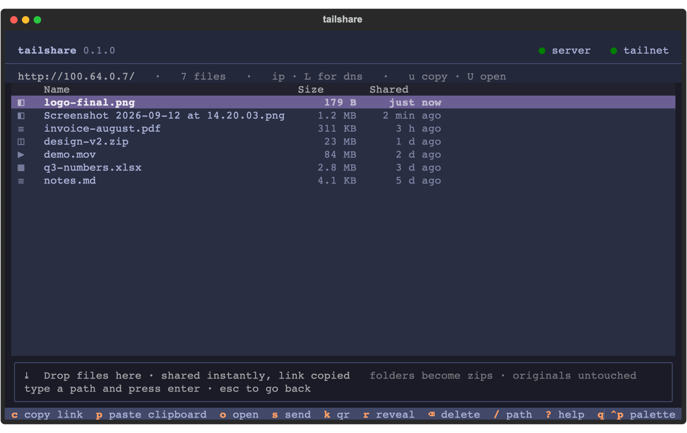
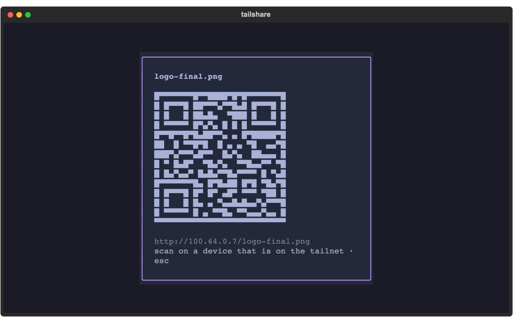
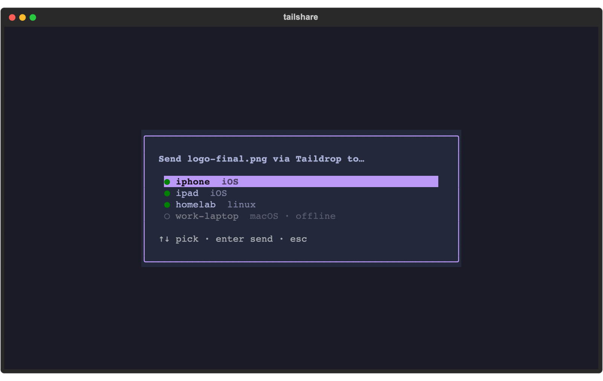
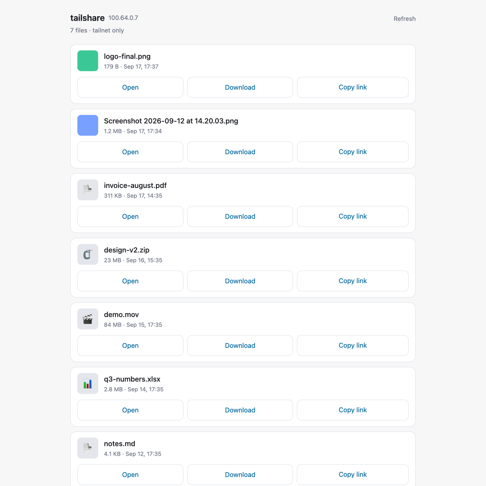
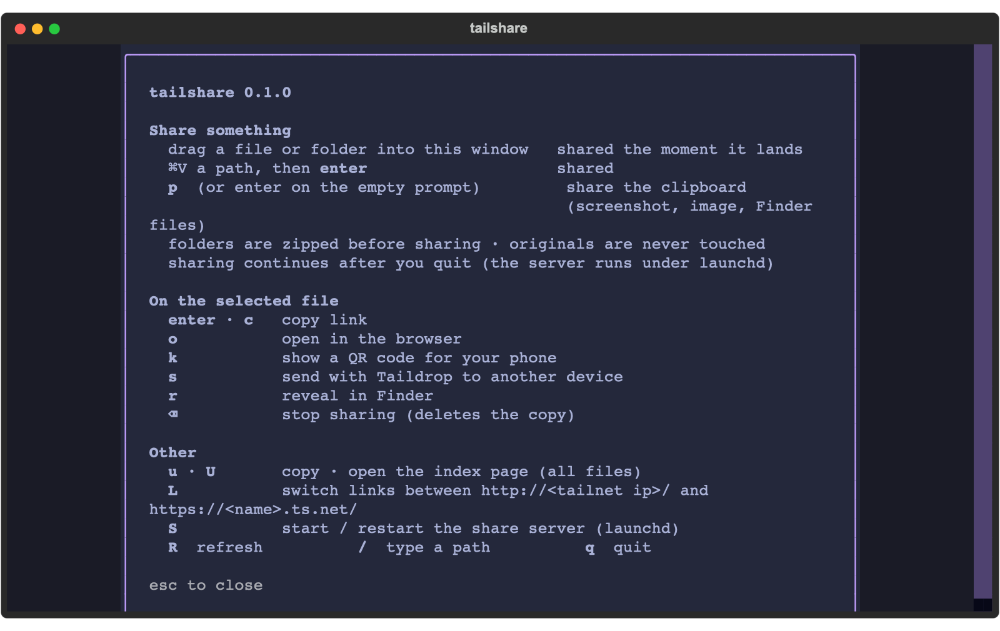

<h1 align="center">tailshare</h1>

<p align="center">
  Drop a file into your terminal. Get a link that works on every device in your tailnet.
</p>

<p align="center">
  
</p>

---

`tailshare` is a small macOS terminal app for the "I need this file on my phone / the other laptop / the
server" moment. Drag a file into the window (or paste a screenshot) and it is instantly available at
`http://100.x.y.z/<file>` to anything logged into your [Tailscale](https://tailscale.com) network,
with the link already on your clipboard. Nothing leaves the tailnet.

## Features

- **Drag and drop.** Drop a file or folder from Finder into the terminal window. It is shared the moment
  it lands. Folders are zipped first. Originals are never moved or modified.
- **Clipboard.** Press `p` to share whatever is on the clipboard: a screenshot (`⌘⇧⌃4`), an image
  copied from a browser, or files copied in Finder with `⌘C`.
- **Links that just work.** Plain `http://<tailnet ip>/file` links by default, so they work on devices
  without MagicDNS. Flip to `https://<name>.ts.net/` with `L`.
- **See what is shared.** Newest first, with size and age. Copy the link, open it, show a QR code for
  your phone, send the file with Taildrop, reveal it in Finder, or stop sharing it.
- **Survives reboots.** The share server runs under a `launchd` agent. Close the TUI, the links keep working.
- **A web index for other devices.** Open the base URL on a phone and get a touch-friendly page with
  thumbnails and Open / Download / Copy link per file.

<p align="center">
  
  
</p>

<p align="center">
  
</p>

## Install

Requirements: macOS, the [Tailscale app](https://tailscale.com/download/mac), and
[uv](https://docs.astral.sh/uv/). Python is fetched by uv if needed.

```sh
uv tool install git+https://github.com/nicscl/tailshare
tailshare install     # one time: launchd agent + tailscale serve routes
tailshare             # open the TUI
```

`tailshare install` needs HTTPS certificates enabled on your tailnet for the DNS links
(Tailscale admin console → DNS → HTTPS Certificates). IP links work without it.

## Keys

| Key | Action |
|-----|--------|
| *drop a file* | share it, copy the link |
| `p` | share the clipboard (screenshot, image, Finder files) |
| `/` | type or paste a path, `enter` to share, `esc` to go back |
| `enter` / `c` | copy link of the selected file |
| `o` | open it in the browser |
| `k` | QR code, for scanning with a phone |
| `s` | send with Taildrop to another device |
| `r` | reveal in Finder |
| `⌫` | stop sharing (deletes the shared copy, never the original) |
| `L` | toggle IP / DNS links |
| `u` / `U` | copy / open the index page |
| `S` | start or restart the share server |
| `?` / `q` | help / quit |

<p align="center">
  
</p>

## Non-interactive use

```sh
tailshare add ~/Desktop/report.pdf -c   # share, print the URL, copy it
tailshare add ./build/                  # folders are zipped
tailshare paste -c                      # share the clipboard
tailshare ls                            # everything shared, with URLs
tailshare url report.pdf
tailshare rm report.pdf
tailshare status                        # server, launchd, tailscale, serve routes
```

## How it works

```
 Finder drop / clipboard
          │
          ▼
  ~/Public/ts-share  ◀──  tailshare serve  (127.0.0.1:8787, localhost only)
                                  ▲
                                  │  tailscale serve
        ┌─────────────────────────┴──────────────────────────┐
        │  --tcp=80  raw forward   →  http://100.x.y.z/        │  default links
        │  https/443 proxy         →  https://<name>.ts.net/   │  L to switch
        └────────────────────────────────────────────────────┘
```

- Files are copied into `~/Public/ts-share` (override with `TAILSHARE_DIR`). Copies are staged as
  hidden `.part` files and renamed into place, so a half-copied file is never served.
- `tailshare serve` is a small HTTP server bound to localhost. It never listens on a network interface;
  only Tailscale can reach it. Hidden files and symlinks are never listed or served, and shared HTML
  is served with a sandboxing CSP.
- The App Store build of Tailscale cannot serve a directory directly ("Path serving is not supported on
  macOS"), which is why a local server is needed at all. A plain `--http=80` route also does not work
  for bare-IP links, because it matches on the Host header; the raw TCP forward on port 80 avoids that.
- `tailshare install` writes `~/Library/LaunchAgents/com.nicholas.tailshare.plist` (KeepAlive,
  RunAtLoad) and configures both serve routes. Logs go to `~/Library/Logs/tailshare.log`.

## Configuration

| Variable | Default | Meaning |
|----------|---------|---------|
| `TAILSHARE_DIR` | `~/Public/ts-share` | folder that is shared |
| `TAILSHARE_PORT` | `8787` | localhost port of the share server |
| `TAILSHARE_LINKS` | `ip` | `ip` for `http://100.x.y.z/`, `dns` for `https://<name>.ts.net/` |

Set them before `tailshare install` so the launchd agent picks them up.

## Troubleshooting

- **Link opens on the phone but not in Chrome on the Mac.** Chrome's Secure DNS can hide MagicDNS
  names. Use the IP link, or turn off Secure DNS in Chrome.
- **Status shows `server offline`.** Press `S` in the TUI, or run `tailshare install`. Check
  `~/Library/Logs/tailshare.log`.
- **Status shows a serve route `MISSING`.** `tailshare install` re-applies both routes. If your tailnet
  has HTTPS certificates disabled, the DNS route fails but IP links still work.
- **A drop types the path instead of sharing.** Your terminal did not send it as a paste. Press `/`
  first, then drop; `enter` shares it.

## Development

```sh
git clone https://github.com/nicscl/tailshare && cd tailshare
uv tool install --editable .     # edits are live
uv run python -m tailshare       # or run from the checkout
```

Built with [Textual](https://textual.textualize.io). The drag-and-drop path was verified against
iTerm2's bracketed paste, and the UI was reviewed with a second model before shipping.
